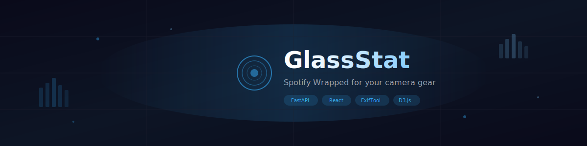
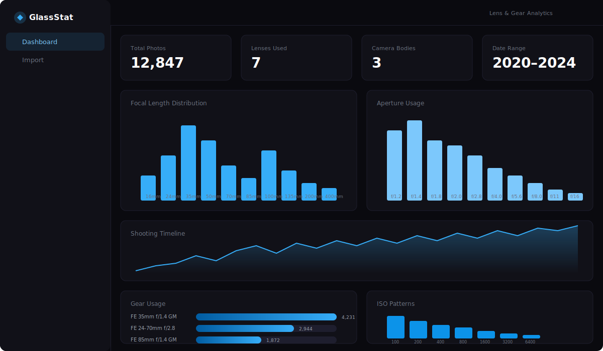
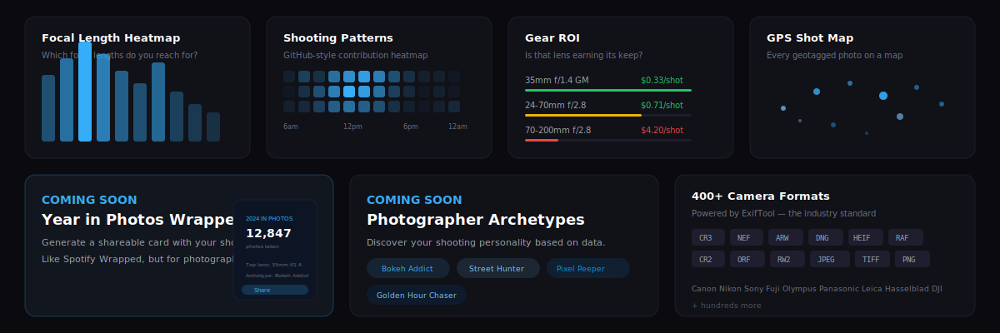

<p align="center">
  
</p>

<p align="center">
  <strong>Spotify Wrapped for your camera gear.</strong><br/>
  Scan your photo library and discover how you actually shoot — which lenses you reach for, your aperture habits, when you're most creative, and whether that 70-200 is earning its keep.
</p>

<p align="center">
  
  
  
  
</p>

---

## Dashboard Preview

<p align="center">
  
</p>

## Features

<p align="center">
  
</p>

## Quick Start

### Docker (Recommended)

```bash
git clone https://github.com/acetodani/glassstat.git
cd glassstat
docker-compose up
```

Open [http://localhost:3000](http://localhost:3000)

### Try With Demo Data

Don't have photos handy? Seed 5,000 realistic sample photos:

```bash
curl -X POST http://localhost:8000/api/demo/seed
```

Refresh the dashboard — instant analytics.

### Manual Setup

**Backend:**
```bash
cd backend
python -m venv .venv && source .venv/bin/activate
pip install -r requirements.txt
uvicorn app.main:app --reload
```

Requires [ExifTool](https://exiftool.org/) installed (`brew install exiftool` on macOS).

**Frontend:**
```bash
cd frontend
npm install
npm run dev
```

## How It Works

```
┌─────────────┐     ┌───────────┐     ┌──────────┐     ┌───────────┐
│ Your Photos │────▶│  ExifTool │────▶│  SQLite  │────▶│ Dashboard │
│ (any format)│     │  (parser) │     │   (DB)   │     │  (React)  │
└─────────────┘     └───────────┘     └──────────┘     └───────────┘
```

1. Point GlassStat at your photo folder (or drag-and-drop files)
2. ExifTool extracts metadata from 400+ camera formats
3. Data is stored locally in SQLite (your photos never leave your machine)
4. React dashboard renders interactive visualizations

## Supported Formats

| Category | Formats |
|----------|---------|
| RAW | CR2, CR3, NEF, ARW, ORF, RW2, RAF, DNG |
| Standard | JPEG, PNG, TIFF |
| Modern | HEIF, HEIC, AVIF |

Works with Canon, Nikon, Sony, Fuji, Olympus, Panasonic, Leica, Hasselblad, DJI drones, and more.

## Architecture

| Layer | Stack |
|-------|-------|
| Backend | Python 3.12, FastAPI, SQLModel |
| EXIF | ExifTool (industry standard, 400+ formats) |
| Database | SQLite (local) / PostgreSQL (deploy) |
| Frontend | React 18, TypeScript, Vite, Tailwind |
| Charts | Recharts + D3.js |
| Maps | Leaflet |
| Deploy | Docker Compose |

## Roadmap

- [ ] Shareable "Year in Photos" wrapped card
- [ ] Photographer archetype classifier
- [ ] Community comparison (anonymous, opt-in)
- [ ] Multi-library support (Lightroom catalog import)
- [ ] Export stats as PDF
- [ ] Dark/light mode toggle

## Privacy

Your photos never leave your machine. GlassStat only reads metadata — it doesn't copy, upload, or modify your files. The SQLite database stores EXIF data only (no thumbnails, no pixel data).

## Contributing

PRs welcome. See [CONTRIBUTING.md](CONTRIBUTING.md) for guidelines.

## License

MIT
